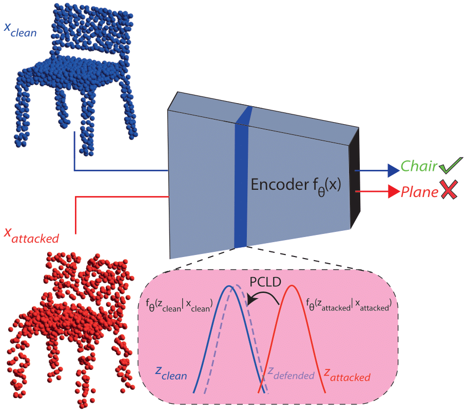
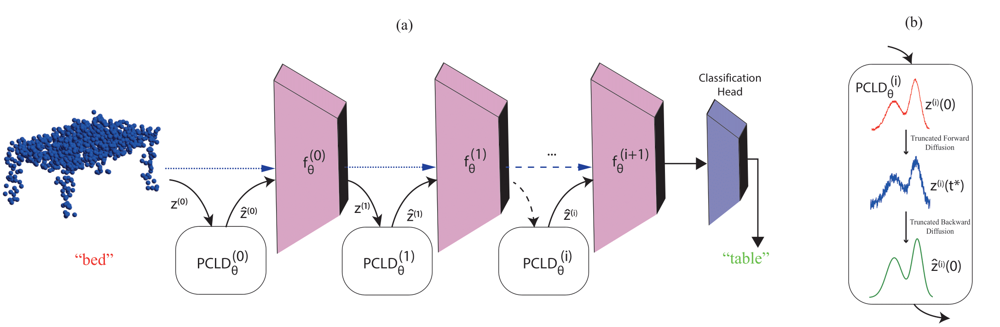

# PCLD: POINT CLOUD LAYERWISE DIFFUSION FOR ADVERSARIAL PURIFICATION

[Mert Gülşen](https://github.com/qwertymert), [Batuhan Cengiz](https://batuceng.github.io/), [Yusuf H. Sahin](https://scholar.google.com.tr/citations?user=62rdgoYAAAAJ&hl), [Gozde Unal](https://gozde-unal.github.io/) <br />

The official repository for the titled preprint: [[`arxiv`](https://arxiv.org/pdf/2403.06698)]

## Abstract

<!-- <style>
    .row {
        display: flex;
    }
    
    .column {
        padding: 5px;
    }
</style>

<div class="row">
  <div class="column">
    
  </div>
  <div class="column">
    
  </div>
</div> -->

<style>
td, th {
   border: none!important;
}
</style>

<table>
  <tr>
    <td></td>
    <td></td>
  </tr>
</table>

Point clouds are extensively employed in a variety of real-world applications such as robotics, autonomous driving and augmented reality. Despite the recent success of point cloud neural networks, especially for safety-critical tasks, it is essential to also ensure the robustness of the model. A typical way to assess a model's robustness is through adversarial attacks, where test-time examples are generated based on gradients to deceive the model. While many different defense mechanisms are studied in 2D, studies on 3D point clouds have been relatively limited in the academic field. Inspired from PointDP, which denoises the network inputs by diffusion, we propose Point Cloud Layerwise Diffusion (PCLD), a layerwise diffusion based 3D point cloud defense strategy. Unlike PointDP, we propagated the diffusion denoising after each layer to incrementally enhance the results. We apply our defense method to different types of commonly used point cloud models and adversarial attacks to evaluate its robustness. Our experiments demonstrate that the proposed defense method achieved results that are comparable to or surpass those of existing methodologies, establishing robustness through a novel technique. 

## Installation
The required Python libraries should be installed.

```
pip install -r requirements.txt
```

## Citation
If you find our work helpful, please consider citing:

```
@article{gulsen2024pcld,
  title={PCLD: Point Cloud Layerwise Diffusion for Adversarial Purification},
  author={Gulsen, Mert and Cengiz, Batuhan and Sahin, Yusuf H and Unal, Gozde},
  journal={arXiv preprint arXiv:2403.06698},
  year={2024}
}
```